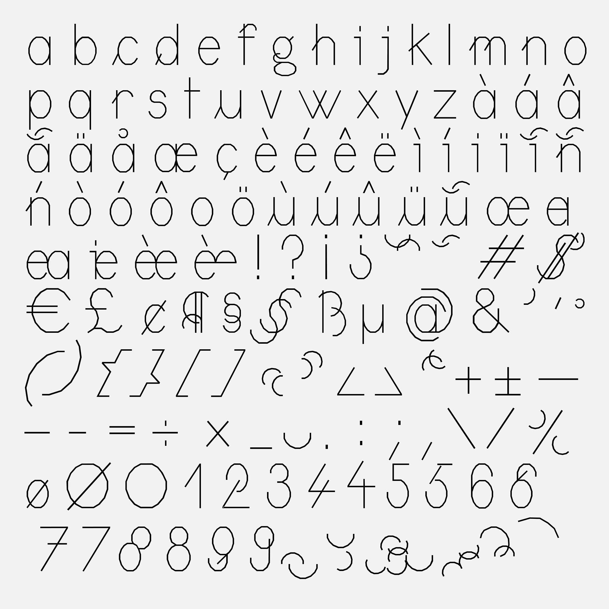
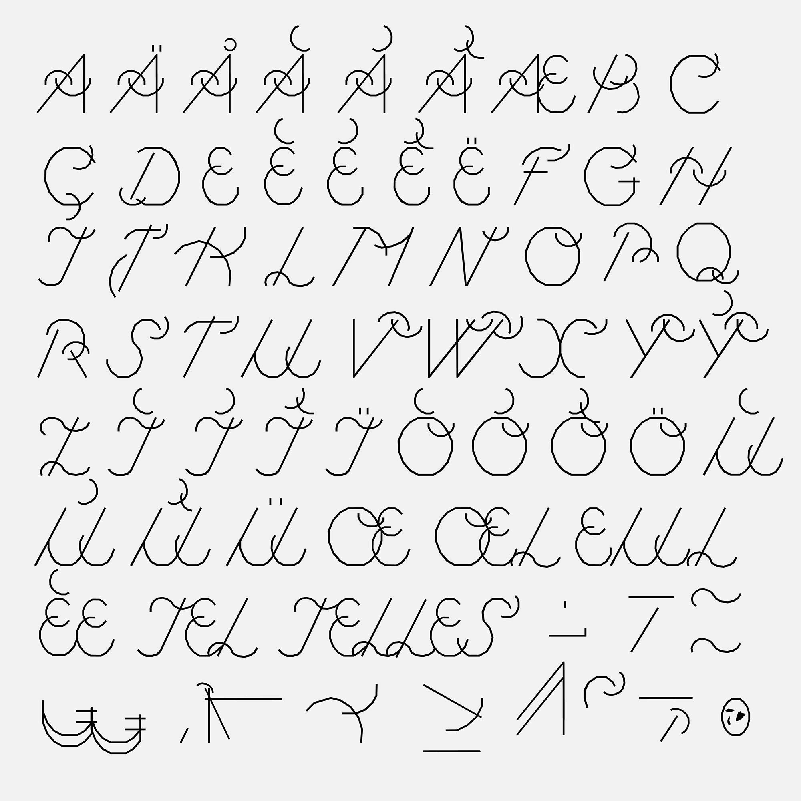
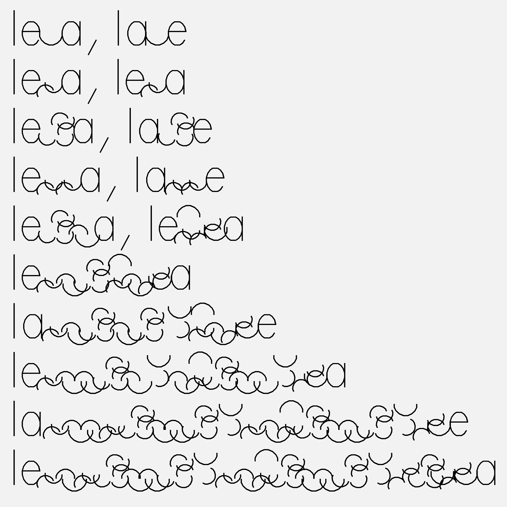

# *CirrusCumulus*
*CirrusCumulus* was designed without curve, made up of different modules inspired by scientific diagrams. *CirrusCumulus* is also a hybridization of two styles : it’s both a lineal by its lowercases, as well as a script by its uppercases, while some adopt italic and create unusual pairs by using arabesques and ligatures. *CirrusCumulus* includes a large panel of glyphs to draw figures, shapes or patterns, a variable ligature system, non-binary and many inclusive glyphs.  

If you use or modify this font, I would be happy to see your uses to evolve this project. 
You can contact me here ->[@Clara_Sambot](https://www.instagram.com/clara_sambot/?hl=fr) ->
clarasambot@gmail.com

Drawing initiated in 2019 by Clara Sambot, at ERG, Brussels  
Thanks to Ludi Loiseau, Marie-Christophe Lambert, Sébastien Sanfilippo and Antoine Gelgon  
Tool used: FontForge font editor  

Copyright (c) 05/16/2020, Clara Sambot, clarasambot@gmail.com.
With reserved font name CirrusCumulus.
This font software is licensed under the SIL Open Font License, version 1.1.
This license is copied below and is also available with a FAQ at: http://scripts.sil.org/OFL