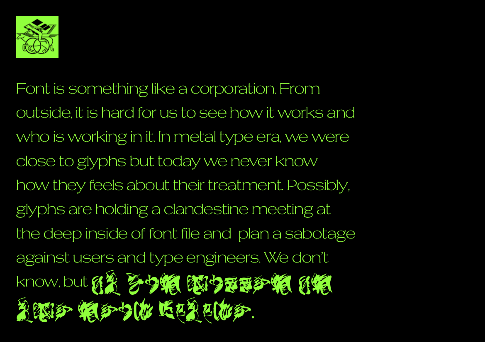

# Mess

*Mess* is a typeface designed by [Tezzo Suzuki](http://tezzosuzuki.com/) and released by [Velvetyne Type Foundry](http://velvetyne.fr/fonts/mess/).

Font is something like a corporation. From outside, it is hard for us to see how it works and who is working in it. In metal type era, we were close to glyphs but today we never know how they feels about their treatment. Possibly, glyphs are holding a clandestine meeting at the deep inside of font file and plan a sabotage against users and type engineers. We don't know, but…

Contribute or download it on [Velvetyne Type Foundry](http://velvetyne.fr/fonts/mess/).

## Specimen

## License

Mess is licensed under the SIL Open Font License, Version 1.1.
This license is copied below, and is also available with a FAQ at
http://scripts.sil.org/OFL

## Repository Layout

This font repository structure is inspired by [Unified Font Repository v0.3](https://github.com/unified-font-repository/Unified-Font-Repository).
